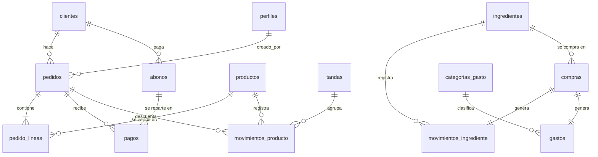

# Database Design — "Sabor de Bohío"

**Última actualización:** 2026-10-06

## Status

PROVISIONALLY SELECTED — diseño derivado de `requirements.md` (VALIDATED). Se valida al escribir las primeras migraciones y sus pruebas.

## Database Technology Decision

- **Tipo:** relacional.
- **Tecnología:** PostgreSQL en Supabase (DEC-001).
- **Razón:** datos fuertemente relacionados (pedido → líneas → sabores, pagos, clientes), operaciones que deben ser atómicas (NFR-R-001) y finanzas que son agregados por período (FR-070 a FR-072).
- **Rechazado:** bases documentales (las finanzas y el stock serían sumas manuales sin garantías de integridad).

## Principios del diseño

1. **El stock no se guarda, se calcula.** Cada cambio es una fila en una tabla de movimientos; el stock actual es la suma (BR-007).
2. **Los pedidos guardan sus precios.** El precio aplicado se copia al pedido al crearlo (BR-001).
3. **Las operaciones con reglas de negocio pasan por funciones SQL (RPC).** Pedidos, pagos, abonos y movimientos no se escriben directamente desde la app; así el servidor garantiza las reglas y la atomicidad.
4. **Nada con historial se borra:** se desactiva (BR-011) o se anula.
5. **Dinero en `numeric(12,2)`**, nunca `float`. Cantidades de ingredientes en `numeric(12,3)`.
6. **Zona horaria del negocio:** `America/Santo_Domingo`. "Hoy" y los períodos financieros se calculan en esa zona.

## Domain Entities

| Entidad | Tabla | Descripción |
|---|---|---|
| Dueño | `perfiles` | Usuario autorizado; 1:1 con `auth.users`. |
| Configuración de precios | `config_precios` | Fila única: precio suelta, precio docena, mínimo para docena, redondeo. |
| Sabor | `productos` | Pollo, res, queso… con stock mínimo opcional. |
| Cliente | `clientes` | Nombre y teléfono opcional. |
| Pedido | `pedidos` | Cabecera con entrega, estado, precios aplicados y totales. |
| Línea de pedido | `pedido_lineas` | Sabor + cantidad. |
| Pago | `pagos` | Dinero recibido para un pedido. |
| Abono | `abonos` | Pago de un cliente que se reparte en pagos de varios pedidos. |
| Tanda | `tandas` | Producción de catibías en un momento dado. |
| Movimiento de sabor | `movimientos_producto` | Entrada/salida de catibías hechas. |
| Ingrediente | `ingredientes` | Con unidad y stock mínimo opcional. |
| Compra | `compras` | Compra de un ingrediente: suma stock y genera gasto. |
| Movimiento de ingrediente | `movimientos_ingrediente` | Compra, ajuste o conteo. |
| Categoría de gasto | `categorias_gasto` | Ingredientes, Gas, Empaques… editables. |
| Gasto | `gastos` | Todo dinero que sale; las compras generan el suyo. |

## Relationships



## Schema Overview

Todas las tablas tienen `id uuid primary key default gen_random_uuid()` y `creado_en timestamptz not null default now()`. Las que registran acciones de un dueño tienen `creado_por uuid not null references perfiles(id) default auth.uid()`.

### Tipos

```sql
create type estado_pedido  as enum ('pendiente', 'listo', 'entregado', 'cancelado');
create type tipo_entrega   as enum ('recoge', 'delivery');
create type metodo_pago    as enum ('efectivo', 'transferencia');
create type tarifa_aplicada as enum ('suelta', 'docena');
create type tipo_mov_producto as enum ('tanda', 'entrega', 'reverso_entrega', 'hecho_al_momento', 'ajuste');
create type tipo_mov_ingrediente as enum ('compra', 'ajuste', 'conteo');
```

### Tablas

| Tabla | Columnas principales | Restricciones |
|---|---|---|
| `perfiles` | `id` (= `auth.users.id`), `nombre` | PK con FK a `auth.users` on delete cascade |
| `config_precios` | `id smallint` (=1), `precio_suelta numeric(12,2) null`, `precio_docena numeric(12,2)`, `minimo_docena int default 6`, `redondeo int default 1`, `actualizado_en`, `actualizado_por` | `check (id = 1)`; `redondeo in (1,5,10)`; `minimo_docena between 1 and 12`; precios ≥ 0 |
| `productos` | `nombre`, `activo bool default true`, `stock_minimo int null`, `orden int` | `nombre` único (sin distinguir mayúsculas); `stock_minimo ≥ 0` |
| `clientes` | `nombre`, `telefono text null`, `notas`, `activo` | índice para búsqueda por nombre y teléfono |
| `pedidos` | `cliente_id`, `fecha_entrega date`, `hora_entrega time null`, `tipo_entrega`, `costo_envio numeric(12,2) default 0`, `notas`, `estado default 'pendiente'`, `unidades int`, `tarifa`, `precio_suelta_aplicado`, `precio_docena_aplicado`, `redondeo_aplicado`, `subtotal`, `total`, `entregado_en timestamptz null`, `version int default 1`, `actualizado_en` | `costo_envio = 0` si `recoge`; `total = subtotal + costo_envio`; `entregado_en` no nulo ⇔ `estado = 'entregado'` |
| `pedido_lineas` | `pedido_id`, `producto_id`, `cantidad int` | `cantidad > 0`; único (`pedido_id`, `producto_id`); on delete cascade desde pedido |
| `pagos` | `pedido_id`, `abono_id null`, `monto numeric(12,2)`, `metodo`, `fecha date`, `anulado_en timestamptz null` | `monto > 0` |
| `abonos` | `cliente_id`, `monto`, `metodo`, `fecha`, `anulado_en null` | `monto > 0` |
| `tandas` | `fecha date`, `notas` | |
| `movimientos_producto` | `producto_id`, `cantidad int` (con signo), `tipo`, `motivo text null`, `pedido_id null`, `tanda_id null` | `cantidad <> 0`; `ajuste` exige `motivo`; `tanda` exige `tanda_id`; `entrega`/`reverso_entrega`/`hecho_al_momento` exigen `pedido_id` |
| `ingredientes` | `nombre`, `unidad text` (lb, kg, unidad, litro, galón…), `stock_minimo numeric(12,3) null`, `activo` | `nombre` único |
| `compras` | `ingrediente_id`, `cantidad numeric(12,3)`, `costo_total numeric(12,2)`, `fecha`, `anulado_en null` | `cantidad > 0`; `costo_total ≥ 0` |
| `movimientos_ingrediente` | `ingrediente_id`, `cantidad numeric(12,3)` (con signo), `tipo`, `motivo null`, `compra_id null` | `cantidad <> 0`; `compra` exige `compra_id` |
| `categorias_gasto` | `nombre`, `activo`, `es_sistema bool` | "Ingredientes" es de sistema (no se desactiva) |
| `gastos` | `categoria_id`, `monto`, `fecha`, `descripcion`, `compra_id null unique`, `anulado_en null` | `monto > 0` |
| `actividad` | `creado_en`, `creado_por null` (null = seed, migración o sistema), `transaccion bigint` (`txid_current()`), `entidad`, `entidad_id text`, `accion` (`crear`, `editar`, `anular`, `restaurar`), `antes jsonb`, `despues jsonb` | única (`transaccion`, `entidad`, `entidad_id`): una acción = una fila. Solo la escriben triggers (DEC-007) |

### Vistas (lectura)

| Vista | Qué devuelve | Requisitos |
|---|---|---|
| `v_stock_productos` | sabor, stock (suma de movimientos), mínimo, `bajo_minimo`, `negativo` | FR-051, FR-053, FR-054 |
| `v_stock_ingredientes` | ingrediente, unidad, stock, mínimo, `bajo_minimo` | FR-062, FR-063 |
| `v_alertas_stock` | unión de sabores e ingredientes en o bajo su mínimo | FR-063 (aviso y contador) |
| `v_pedidos` | pedido + cliente + `pagado` (suma de pagos no anulados) + `saldo` + `estado_pago` (BR-003) + `atrasado` | FR-030, FR-031, FR-040 |
| `v_saldos_clientes` | cliente, saldo de fiado (pedidos entregados con saldo, BR-004), fecha del más viejo | FR-042, FR-012 |

Las vistas se crean con `security_invoker = true` para que respeten RLS.

## Funciones (RPC) — la "API" del sistema

Supabase expone tablas y vistas por REST para lecturas simples; **toda escritura con reglas de negocio pasa por estas funciones**. Cada una corre en una sola transacción, valida que quien llama sea dueño y devuelve el registro resultante. Los errores de negocio se lanzan con mensajes en español para mostrarlos tal cual en la app.

| Función | Hace | Reglas |
|---|---|---|
| `calcular_precio(unidades int)` → subtotal, tarifa, precios aplicados | Aplica BR-012 con `config_precios`. Error claro si falta el precio suelta y *N* < mínimo. | BR-012 |
| `crear_pedido(cliente_id, lineas jsonb, fecha, hora, tipo_entrega, costo_envio, notas, pago jsonb null)` | Inserta pedido + líneas, calcula precio y total en el servidor; opcionalmente registra un pago inicial (incluye "pagado completo"). | FR-020, FR-041, BR-001, BR-002 |
| `actualizar_pedido(id, version, …mismos campos)` | Solo si no está entregado ni cancelado. Recalcula precios con la config **actual**. Falla con "El pedido fue modificado por otra persona" si `version` no coincide. | FR-024, NFR-R-003 |
| `cambiar_estado(id, nuevo_estado, hecho_al_momento bool default false)` | `pendiente ↔ listo`; a `entregado` inserta movimientos `entrega` (o `hecho_al_momento` +N/−N) y fija `entregado_en`; de `entregado` a `listo` inserta `reverso_entrega`; `cancelado` revierte stock si hacía falta. No permite cancelar con pagos vigentes. | FR-022, FR-023, FR-025, FR-026, BR-005, BR-006 |
| `registrar_pago(pedido_id, monto, metodo, fecha)` | Inserta pago; rechaza montos que superen el saldo. | FR-040 |
| `registrar_abono(cliente_id, monto, metodo, fecha, pedido_id null)` | Crea el abono y lo reparte en pagos: al pedido indicado o, si no, del pedido más viejo al más nuevo. Rechaza montos mayores que el saldo del cliente. | FR-043, DEC-003 |
| `anular_pago(pago_id)` / `anular_abono(abono_id)` | Marca `anulado_en` (el abono anula sus pagos). | "Deshacer" de la UI |
| `registrar_tanda(lineas jsonb, fecha, notas)` | Crea la tanda y un movimiento `tanda` por sabor. | FR-050 |
| `ajustar_stock_producto(producto_id, cantidad, motivo)` | Movimiento `ajuste` con motivo obligatorio. | FR-052 |
| `registrar_compra(ingrediente_id, cantidad, costo_total, fecha)` | Compra + movimiento `compra` + gasto en categoría "Ingredientes". | FR-061, BR-009 |
| `registrar_conteo(ingrediente_id, cantidad_contada)` | Inserta el movimiento `conteo` por la diferencia para que el stock quede igual a lo contado. | FR-062 |
| `resumen_financiero(desde date, hasta date)` | Vendido (pedidos entregados en el período), cobrado (pagos no anulados), cobrado por método, por cobrar (fiado), gastos, ganancia aproximada, unidades por sabor. | FR-070 a FR-072, BR-010 |

Escrituras directas permitidas (CRUD simple, sin reglas cruzadas): `productos`, `clientes`, `ingredientes`, `categorias_gasto`, `gastos` (los que no vienen de compras), `config_precios`.

### Regla de precio (BR-012) en SQL

```sql
-- n = unidades totales del pedido (todos los sabores juntos)
case
  when n < cfg.minimo_docena then n * cfg.precio_suelta
  else round((n * cfg.precio_docena / 12) / cfg.redondeo) * cfg.redondeo
end
```

La app calcula el mismo valor en el cliente para mostrar el total en vivo, pero **el valor guardado es siempre el del servidor**.

## Integrity

- Claves foráneas en todas las relaciones; `on delete restrict` salvo `pedido_lineas` (cascade desde pedido).
- Los `check` de la tabla anterior.
- Un trigger mantiene `pedidos.actualizado_en` y aumenta `version` en cada cambio.
- Los movimientos, pagos, abonos y compras son de **solo inserción** (más la marca `anulado_en`); nunca se actualizan cantidades ni se borran.

## Transactions

Cada RPC es una transacción. Las operaciones críticas (NFR-R-001):
- `crear_pedido`: pedido + líneas + pago inicial.
- `cambiar_estado`: estado + movimientos de stock.
- `registrar_abono`: abono + reparto en pagos.
- `registrar_compra`: compra + movimiento + gasto.

Para evitar dobles entregas o dobles abonos simultáneos, las funciones bloquean la fila afectada con `select … for update`.

## Security (capa de datos)

**Implementado en la Fase 1** (`supabase/migrations/2026100605*`):
- `es_dueno()` es `security definer` para leer `perfiles` sin depender de su propia política (evita recursión). `exigir_dueno()` corta las RPC con "No tienes permiso para hacer esto." (código 42501).
- Ninguna función nueva se puede ejecutar por defecto: la migración base revoca `execute` a `PUBLIC` (global), `anon` y `authenticated`. Cada RPC concede `execute` a `authenticated` de forma explícita.
- Cada tabla revoca todo a `anon` y `authenticated` y concede solo lo necesario, **por columna** en las escrituras (p. ej. la app no puede escribir `categorias_gasto.es_sistema` ni `config_precios.actualizado_por`). `delete` no se concede en ninguna tabla (BR-011).
- `config_precios` nace con docena RD$550, mínimo 6, redondeo 1 y precio suelta sin definir; un trigger guarda `actualizado_en` y `actualizado_por`.
- La categoría "Ingredientes" se crea en la migración (`es_sistema = true`) y un trigger impide renombrarla o desactivarla.
- Las funciones internas (p. ej. `privado.leer_lineas`) viven en el esquema `privado`, que PostgREST no expone y sobre el que nadie tiene permisos.
- **Fase 2:** `pedidos`, `pedido_lineas`, `tandas` y `movimientos_producto` solo se leen; se escriben con `crear_pedido`, `actualizar_pedido`, `cambiar_estado` y `registrar_tanda`. `v_pedidos` todavía no trae columnas de pagos (llegan en la Fase 3). `public.hoy()` da la fecha en America/Santo_Domingo. Salir de *entregado* reintegra lo que descontaron las entregas; la producción "hecha al momento" se conserva y esas catibías vuelven al stock (DEC-006).
- **Fase 3:** `pagos` y `abonos` solo se leen; se escriben con `registrar_pago`, `anular_pago`, `registrar_abono` y `anular_abono`, y con el `p_pago` opcional de `crear_pedido` (pago inicial) y `cambiar_estado` (cobrar al entregar). Las validaciones comunes están en `privado.insertar_pago`: nunca se paga más que el saldo (no hay saldo a favor). `v_pedidos` suma `pagado`, `saldo` y `estado_pago` (BR-003). `v_saldos_clientes` da `saldo_fiado` (entregados, BR-004), `saldo_total` (no cancelados), `pedidos_fiados` y `fiado_desde`. Un pedido con pagos vigentes no se cancela, y al editarlo el total no puede quedar por debajo de lo pagado. Los abonos sin pedido se reparten del pedido más viejo al más nuevo entre los no cancelados con saldo (DEC-003).
- **Fase 4:** `ingredientes` es CRUD directo (sin `delete`). `compras` y `movimientos_ingrediente` solo se escriben con `registrar_compra` (compra + movimiento + gasto en "Ingredientes", BR-009; una compra de costo 0 no genera gasto) y `registrar_conteo` (movimiento por la diferencia; si coincide no inserta nada). `ajustar_stock_producto` registra ajustes de catibías con motivo (FR-052). `gastos` existe desde esta fase: los sueltos son CRUD directo, pero los que vienen de una compra no se pueden crear ni editar desde la app (sin permiso sobre `compra_id` y RLS). Vistas `v_stock_ingredientes` y `v_alertas_stock` (sabores e ingredientes activos en o bajo su mínimo, y sabores en negativo). La pantalla de gastos llega en la Fase 5.
- **Fase 5:** `resumen_financiero(desde, hasta)` (security definer, exige dueño) devuelve un JSON: `vendido` (pedidos entregados en el período según el día real de entrega en Santo Domingo), `envios`, `pedidos_entregados`, `cobrado` y por método (pagos no anulados con fecha en el período), `por_cobrar` (fiado vigente hoy, no depende del período), `gastos` y por categoría (no anulados, incluye compras), `ganancia_aprox` = vendido − gastos (BR-010) y `unidades_por_sabor`. Índice `pedidos_entregado_dia` sobre `privado.dia_sd(entregado_en)`. Los gastos sueltos se anulan con `anulado_en` (no se borran).
- **Actividad (FR-083, DEC-007):** triggers `actividad` en `clientes`, `productos`, `ingredientes`, `categorias_gasto`, `config_precios`, `pedidos`, `pedido_lineas`, `pagos`, `abonos`, `gastos`, `compras`, `tandas` y `movimientos_*` llaman a funciones `privado.actividad_*` (security definer) que guardan una foto jsonb con los nombres ya resueltos. Una acción por transacción y registro: se conserva el primer `antes` y el último `despues` (crear un pedido con sus líneas o editarlo = una entrada). No se anota aparte lo que es consecuencia de otra acción: movimientos de entregas y tandas, pagos repartidos por un abono, gasto y movimiento de una compra. Editar sin cambiar nada (o reordenar sabores) no se anota. `authenticated` solo tiene `select` (con RLS de dueño); nadie inserta, edita ni borra a mano.
- En `config.toml`, `[auth] enable_signup = false` bloquea el registro público. `[auth.email] enable_signup` debe quedar en `true`: en `false` desactiva todo el login por correo.

- **Registro público desactivado** en `supabase/config.toml`; los dos dueños se crean a mano (seed local / invitación en producción).
- **RLS activado en todas las tablas.** Política única por tabla: permitido solo si `es_dueno()` (existe fila en `perfiles` para `auth.uid()`).
- **Tablas protegidas** (`pedidos`, `pedido_lineas`, `pagos`, `abonos`, `tandas`, `movimientos_*`, `compras`): `select` permitido a dueños; `insert/update/delete` **revocados** al rol `authenticated`. Solo las RPC (`security definer`, `set search_path = ''`, que verifican `es_dueno()` al inicio) pueden escribir.
- Datos personales: nombres y teléfonos de clientes. No se guardan datos de pago (números de cuenta o tarjetas).
- Pruebas de RLS obligatorias (`testing.md`): un usuario autenticado que no es dueño no puede leer ni escribir nada.

## Query Patterns

| Patrón | Frecuencia | Soporte |
|---|---|---|
| Pedidos de hoy + atrasados no entregados | Muy alta | índice `pedidos (estado, fecha_entrega)` |
| Buscar cliente por nombre/teléfono | Alta | índice trigram (`pg_trgm`) en `clientes.nombre` y `telefono` |
| Stock actual y alertas | Alta | suma por `producto_id` / `ingrediente_id` con índices en esas columnas |
| Saldos de fiado | Media | `pagos (pedido_id)`, `pedidos (cliente_id)` |
| Resumen financiero por período | Baja | índices por fecha en `pagos`, `gastos`, `pedidos.entregado_en` |
| Actividad, lo más reciente primero (de 40 en 40, filtro por tipo) | Baja | índices `actividad (creado_en desc)` y `(entidad, creado_en desc)` |

Con el volumen esperado no hacen falta tablas de resumen ni cachés: las sumas sobre movimientos son instantáneas.

## Data Growth

Supuesto A-01: decenas de pedidos por semana; diseño probado mentalmente hasta ~500/semana (NFR-S-001) ≈ 26.000 pedidos y ~100.000 movimientos al año. Trivial para Postgres. La actividad suma una fila por acción (del orden de los pedidos + pagos + gastos) y se guarda sin límite.

## Backup & Recovery

- **NFR-R-002** exige copia diaria. **Verificado (Fase 6):** el plan gratuito de Supabase no incluye copias de seguridad (las diarias empiezan en Pro).
- Por eso `.github/workflows/backup.yml` corre a diario: `supabase db dump` (esquema y datos, incluye `auth.users`) → `tar.gz` → cifrado AES-256 con `BACKUP_PASSPHRASE` → artefacto privado con retención de 30 días. Contiene teléfonos de clientes, así que nunca se sube sin cifrar. Restauración en `despliegue.md`.
- El esquema completo es reproducible desde `supabase/migrations/` (DEC-001).

## Seed de desarrollo (`supabase/seed.sql`)

- Dos dueños de prueba (`leo@bohio.test`, `maria@bohio.test`), una dueña recién creada con contraseña temporal (`ana@bohio.test`, `user_metadata.clave_temporal = true`, para la guía del primer inicio) y un usuario sin perfil (`intruso@bohio.test`) para probar RLS. Contraseña local: `bohio-local-123`.
- Sabores: Pollo, Res, Queso.
- `config_precios`: docena RD$550, mínimo 6, redondeo 1, precio suelta de ejemplo.
- Categorías: Ingredientes (sistema), Gas, Empaques, Transporte.
- Algunos clientes de ejemplo.
- Ingredientes (Fase 4) y pedidos de ejemplo (Fase 2) se agregan cuando existan sus tablas.

## Assumptions

- A-01 (volumen bajo), A-06 (fiado por pedido).
- Un pedido cancelado no tiene pagos vigentes (se anulan antes).
- No se maneja "saldo a favor": un abono no puede superar lo que el cliente debe.

## Confidence

**Media-alta.** El modelo sigue directamente las reglas de negocio validadas. Los puntos a confirmar con el uso son el reparto de abonos (DEC-003) y la cobertura de copias de seguridad del plan de Supabase.
